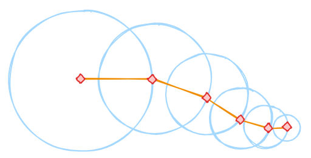
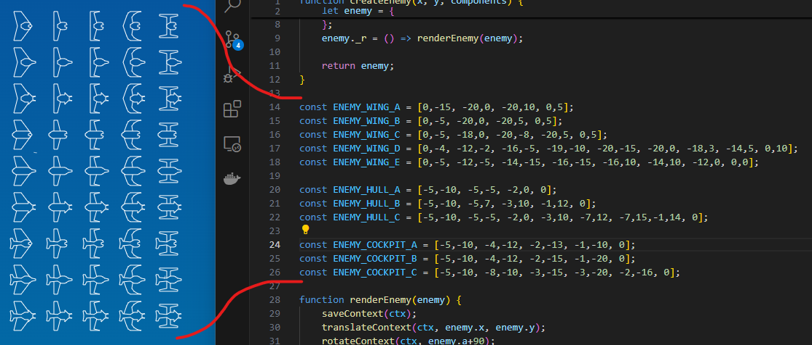

# Making of "Aargh! Triskaideka attacks!" for the js13kgames.com Jam
WORK IN PROGRESS!
## The theme was announced! "Triskaidekaphobia"

**"Triskaidekaphobia" ?!?!?** What the fraggle?

My first reactions were like this:

* looking at the screen in disbelief
* hit [F5]
* stare again at the screen
* mumble a very slow "What..... the..... fraggle ?"
* google the word
* read wikipedia entry
* stare at the screen
* mumble an even slower "What..... the..... fraggle ?"
* look at the white wall behind my monitor... (quite some time)
* mumble "oh my... this sadistic end3r... ! I bet he is still laughing..."

## Theme-brainstorming-result

Aliens. The "Triskaideka" are an alien race everyone is afraid of. [End]
Yep. thats it. :-)

## The first player character
The first iteration of gameplay featured a snake-like creature as player to be controlled by gamepad or keyboard.

### Idea and concept prototypes
I wanted to add a procedurally generated creature, so i played a bit with a bunch of circles following the mouse in different distances. Which looked nice when the mouse was in movement, but it streched to much when the mouse was too fast, and collapsed into one point when the mouse stopped.

So i came up with the idea, that one circle should follow the previous one in a defines distance, and only the first is controlled by keyboard.

So the position of the "head" of the "snake" was now directly updated (each frame) depending on keyboard-inputs and the segments of the tail were updated to move in the directon of the previous segment until the desired distance is reached (essentially a calculation of the vector between the two midpoints of the segments, then clamping that vector to the distance of the segment and setting the child-segments x/y to this new position). This looked pretty organic in movement.

Then i added a hull for the creature by calculation the 90° positions left and right and connecting them by an outline.

### Gamepad

At this stage i added gamepad-support for the player character, which was quite easy using the Gamepad API.

Only one problem occured, when my headphone (which also has buttons) registered itself also as gamepad. But thats easy: only a check for mapping == "standard" was needed to ignore headphones.

### Recognizing that its "Prior art" on YouTube...
During research, for some angle-depending problems with the creature (it folded into itself and looked akward) i stumbled upon the very same methoid of procedural generation of fish-like creatures. So, i invented nothing at all... (not that i thought that, but i was very proud of myself at this point)

Here is the youtube-video that EXACTLY describes, what i was doing up to that point... haha: <a href="https://www.youtube.com/watch?v=qlfh_rv6khY" target="_blank">argonaut - A simple procedural animation technique (YouTube)</a>

## create a different player character
While the creature was looking really nice, and it ok to move it across the screen, i decided, that this alien should be the enemy. 

So i added a simple Asteroids-like spaceship (triangle) as player character and some lasers to shoot at the alien invader. This instantly made the game more fun to play. 

## Music. Soundbox to the rescue!

At this stage (player shooting at snake) there was one thing missing: music and SFX.
For the music i first thought about adding some very heavy metal (like in Doom) to emphasise the action. But i was unable to get the instruments in Soundbox to a descent "power-level" and also my beats didnt sound very "metal". So i thought of the good old 80th and their gorgeous action tv-shows and finally settled upon Airwolf (the advanced prototype supersonic helicopter with stealth capabilities and a formidable arsenal).

Here is <a href="https://sb.bitsnbites.eu/?data=U0JveA4C7duxalNRGAfw_73BglA3RboIQiWDj-Cgg2OHdHRzqKO0SjU0VAyIGmJKsA0VCfoCPoV08gl8FFdvjW0DemNcisHfD853zvnuHc4H904f5-tK0sjqhXKjmwy6KZLcuZEUrTLlvfWsXV2qNkVZPny83d5t72y3q7lunQW09aTded7ZbXequW4dAAAAAAAAAOY21YC-_eDyrw3oxsukPxi-TUYHZ3GYg0GVT3rpv86L8zzwpWS5Pk6sJdfr40Qv2Rvuj5J3h2dxP4fDKp-8yV4_r_6Ruk5Lm1HXaWm_rWs8fj_60wE-fsj4HOtannqnrq4d_ycAAAAAAAAslKkG9JWbJzegL66n1zq5AT2HRSx8aw4-DwAAAAAAAIC_sNFNvlRjJWk2q_3RUsprrXw7flZUNrP5KJkdAQAAAAAAACDpTsazFLd-ZorPn3K32bhfHjegq_3TH9nZEQAAAAAAAID_3Hc" target="_blank">the final song on sb.bitsnbites.eu</a> (418 bytes compressed)

### SFX
As I now already had the music-player from soundbox in my code, i also added the SFX as "songs" made in Soundbox. By tweaking the instrument-settings and creating songs with one or a couple of notes i created explosions, hit-sounds and laser-fire with a very low additional impact on the size of the game.

Example: <a href="https://sb.bitsnbites.eu/?data=U0JveA4C6xRlAAIWRqaUyZzMJ7sZJBUZmG0sgEKHWRiYnQSCvjAweDIy9jGMglEwCmgFAA" target="_blank">Laser</a> with 138 bytes (compressed)

## Add other enemies
To make the game more interesting i added another type of enemies: simple fighter-ships. To make a bigger variety of ships with the tiniest amount of code, i decided to build a generator based on components.

5 different wing-types, 3 different canopy-types and 3 different cockpit-types are resulting in 45 different ships, that share a common design.

All components consist of a couple of points connected by lines and are mirrored to the other side.

### Prerendering for performance
I did not want to draw all those lines of all enemies (which can get pretty much) for every frame, so i created a function/object that contains an offscreen-canvas, where the enemy could be rendered once. That Canvas the is used as source for the drawImage-command during rendering of the game. See <a href="../src/spritebuffer.js" target="_blank">src/spritebuffer.js</a> and <a href="../src/enemy.js#L84" target="_blank">src/enemy.js#L84</a> for the simple code and usage.

## Add bigger enemies

## Add another even bigger enemytype

## Reaching the 13k Limit - Roadroller to the rescue!

## Add a Story and Levels

## Add polish

### HUD

### Height-limitation

### Water reflection

### Horde-Mode
